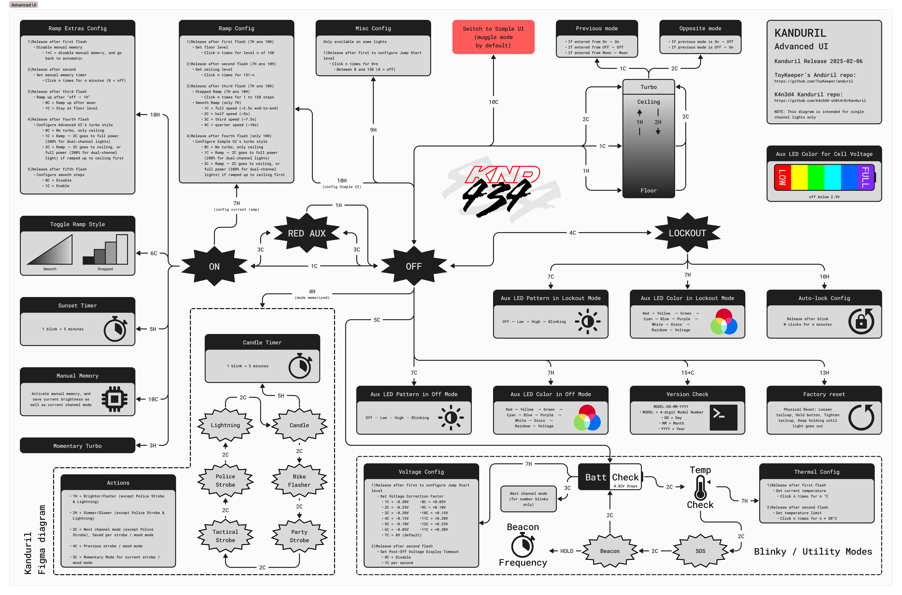

# Kanduril

My configuration and modifications for anduril 2 firmware on my D4K single channel

It may not work properly on other flashlights as it's based and work on the model n°0273. I'm describing everything I changed and where I changed it in each drop-down list if you want to do the same as my configuration.

## Diagrams



## Changes

<details>
  <summary>Recreate a muggle mode like Anduril 1 (replace simple ui)</summary> 

- Limit the ceiling of simple ui \
set `#define SIMPLE_UI_CEIL` to `30` \
*Kanduril/hw/hank/noctigon-dm11/boost/anduril.h*

- Limit the steps of simple ui \
set `#define SIMPLE_UI_STEPS` to `3` \
*Kanduril/hw/hank/noctigon-dm11/boost/anduril.h*

- Disable battery check on simple ui \
add `&& cfg.simple_ui_active != 1` as a condition in the else if of `#ifdef USE_BATTCHECK` \
*Kanduril/ui/anduril/off-mode.c*

- Disable strobe mode on simple ui \
add `&& cfg.simple_ui_active != 1` as a condition in the else if of `#ifdef USE_STROBE_STATE` \
*Kanduril/ui/anduril/off-mode.c*

- Disable boring strobe mode on simple ui \
add `&& cfg.simple_ui_active != 1` as a condition in the else if of `#ifdef USE_BORING_STROBE_STATE` \
*Kanduril/ui/anduril/off-mode.c*

- Disable lockout mode on simple ui \
add `&& cfg.simple_ui_active != 1` as a condition in the else if of `#ifdef USE_LOCKOUT_MODE` \
*Kanduril/ui/anduril/off-mode.c*

- Disable version check on simple ui \
add `&& cfg.simple_ui_active != 1` as a condition in the else if of `#ifdef USE_VERSION_CHECK` \
*Kanduril/ui/anduril/off-mode.c*

- Disable turbo 2C hold on simple ui \
add `&& cfg.simple_ui_active != 1` as a condition in the event of `event == EV_click2_hold` \
*Kanduril/ui/anduril/off-mode.c*

- Set the level to moon when entering simple ui \
add `memorized_level = nearest_level(0);` to the `else if (event == EV_10clicks)` \
*Kanduril/ui/anduril/off-mode.c*

- Change the enter state event of the steady state so that it does nearest level everytime exept when it's MAX_LEVEL but do it everytime when it's on simple ui \
replace `arg = nearest_level(arg);` by 
  ```
  if (arg != MAX_LEVEL || cfg.simple_ui_active == 1) {
    arg = nearest_level(arg);
  }
  ```
  *Kanduril/ui/anduril/ramp-mode.c*
</details>

<details>
  <summary>Switch SOS and Beacon mode to make SOS first</summary>

- Change order on battery check state 
  ```
  else if (event == EV_2clicks) {
      #if defined(USE_THERMAL_REGULATION)
      set_state(tempcheck_state, 0);
      #elif defined(USE_SOS_MODE) && defined(USE_SOS_MODE_IN_BLINKY_GROUP)
      set_state(sos_state, 0);
      #elif defined(USE_BEACON_MODE)
      set_state(beacon_state, 0);
      #endif
      return EVENT_HANDLED;
  }
  ```
  *Kanduril/ui/anduril/battcheck-mode.c*

- Change order on temperature check state 
  ```
  else if (event == EV_2clicks) {
      #if defined(USE_SOS_MODE) && defined(USE_SOS_MODE_IN_BLINKY_GROUP)
      set_state(sos_state, 0);
      #elif defined(USE_BEACON_MODE)
      set_state(beacon_state, 0);
      #elif defined(USE_BATTCHECK)
      set_state(battcheck_state, 0);
      #endif
      return EVENT_HANDLED;
  }
  ```
  *Kanduril/ui/anduril/tempcheck-mode.c*

- Change order on sos mode state 
  ```
  else if (event == EV_2clicks) {
      #if defined(USE_BEACON_MODE)
      set_state(beacon_state, 0);
      #elif defined(USE_BATTCHECK_MODE)
      set_state(battcheck_state, 0);
      #elif defined(USE_THERMAL_REGULATION)
      set_state(tempcheck_state, 0);
      #endif
      return EVENT_HANDLED;
  }
  ```
  *Kanduril/ui/anduril/sos-mode.c*

- Change order on beacon mode state 
  ```
  else if (event == EV_2clicks) {
      #if defined(USE_BATTCHECK)
      set_state(battcheck_state, 0);
      #elif defined(USE_THERMAL_REGULATION)
      set_state(tempcheck_state, 0);
      #elif defined(USE_SOS_MODE) && defined(USE_SOS_MODE_IN_BLINKY_GROUP)
      set_state(sos_state, 0);
      #endif
      return EVENT_HANDLED;
  }
  ```
  *Kanduril/ui/anduril/beacon-mode.c*
</details>

<details>
  <summary>Set default RGB aux to my preferences</summary>

- Disable the Hank's hardware preset for the aux \
comment `#define RGB_LED_OFF_DEFAULT 0x18` \
*Kanduril/hw/hank/anduril.h*

- Set the aux on low cyan when off \
set `#define RGB_LED_OFF_DEFAULT` to `0x13` \
*Kanduril/ui/anduril/aux-leds.h*

- Set the aux on low voltage when lock \
set `#define RGB_LED_LOCKOUT_DEFAULT` to `0x19` \
*Kanduril/ui/anduril/aux-leds.h*
</details>

<details>
  <summary>Don't ramp after moon by default</summary>

- Deactivate option to ramp after moon \
add `#define DEFAULT_DONT_RAMP_AFTER_MOON 1` \
*Kanduril/ui/anduril/config-default.h*
</details>

<details>
  <summary>Set the post off voltage to 1sec by default</summary>

- add `#define DEFAULT_POST_OFF_VOLTAGE_SECONDS 1` \
*Kanduril/ui/anduril/config-default.h*
</details>

<details>
  <summary>Set floor to 8 by default to avoid flickering</summary>

- Set 8 for smooth floor \
set `#define RAMP_SMOOTH_FLOOR` to `8` \
*Kanduril/hw/hank/noctigon-dm11/boost/anduril.h*

- Set 8 for discrete floor \
set `#define RAMP_DISCRETE_FLOOR` to `8` \
*Kanduril/hw/hank/noctigon-dm11/boost/anduril.h*
</details>

<details>
  <summary>Set ramp ceiling to 150</summary>

- Set 150 for the ramp ceiling \
set `#define RAMP_SMOOTH_CEIL` to `150` \
*Kanduril/hw/hank/noctigon-dm11/boost/anduril.h*
</details>

<details>
  <summary>Set ramp speed a 1/2 speed</summary>

- Set to 2 for 1/2 \
add `#define DEFAULT_RAMP_SPEED 2` \
*Kanduril/ui/anduril/config-default.h*
</details>

<details>
  <summary>Disable moon mode when lock</summary>

- comment `#define USE_MOON_DURING_LOCKOUT_MODE` \
*Kanduril/ui/anduril/config-default.h*
</details>

<details>
  <summary>Set the jump start at ramp floor level</summary>

- set `#define DEFAULT_JUMP_START_LEVEL` to `RAMP_SMOOTH_FLOOR` \
*Kanduril/hw/hank/noctigon-dm11/boost/anduril.h*
</details>

<details>
  <summary>Blink with the red channel instead of main</summary>

- set `#define DEFAULT_BLINK_CHANNEL` to `CM_AUXRED` \
*Kanduril/hw/hank/noctigon-dm11/boost/anduril.h*
</details>

<details>
  <summary>Disable the blink in the middle</summary>

- comment `#define BLINK_AT_RAMP_MIDDLE` \
*Kanduril/ui/anduril/config-default.h*
</details>

<details>
  <summary>Enable police strobe</summary>

- uncomment `#define USE_POLICE_STROBE_MODE` \
*Kanduril/ui/anduril/config-default.h*
</details>

<details>
  <summary>Set 55 for temp limit</summary>

- For sloppy temperature sensor \
set `#define DEFAULT_THERM_CEIL` to `50` \
*Kanduril/ui/anduril/config-default.h*

- For accurate temperature sensor \
set `#define DEFAULT_THERM_CEIL` to `55` \
*Kanduril/ui/anduril/config-default.h*
</details>

<details>
  <summary>Disable tactical mode</summary>

- Kinda useless mode in my use \
comment `#define USE_TACTICAL_MODE` \
*Kanduril/ui/anduril/config-default.h*
</details>

<details>
  <summary>Battery check on 5C instead of momentary</summary>

- MAKE SURE MOMENTARY IS DISABLE OR SET TO ANOTHER SHORTCUT

- Change shortcut to USE_BATTCHECK \
replace `event == EV_3clicks` with `event == EV_5clicks` \
*Kanduril/ui/anduril/off-mode.c*
</details>

<details>
  <summary>Remove all shortcut from lockout except exit and go off and change the shortcut to 4C instead of 3C</summary>

- Delete all shortcut except exit and go off
*Kanduril/ui/anduril/lockout-mode.c*

- Change shortcut to exit and go off \
replace `event == EV_3clicks` with `event == EV_4clicks` \
*Kanduril/ui/anduril/lockout-mode.c*
</details>

<details>
  <summary>2C goes to turbo advanced and ceiling simple (like anduril 1)</summary>

- Set the default style for advanced \
uncomment `#define DEFAULT_2C_STYLE` and set it to `1` \
*Kanduril/ui/anduril/config-default.h*

- Set the default style for simple \
uncomment `#define DEFAULT_2C_STYLE_SIMPLE` and set it to `0` \
*Kanduril/ui/anduril/config-default.h*
</details>

<details>
  <summary>Change the turbo shortcut to go to memorized level on 1C instead of 2C if entered from ramp && got to memorize on 2C if entered from off && avoid the blink when turning off from low level</summary>

- Add some thing that will be usefull in the next steps \
  ```
  uint8_t prev_in_ramp = 0;
  uint8_t prev_in_moon = 0;
  uint8_t prev_in_off = 0;
  ```
  *Kanduril/ui/anduril/ramp-mode.h*

- Change the 1 click event on ramp \
  ```
  else if (event == EV_1click) {
    if (actual_level == MAX_LEVEL && prev_in_ramp == 1) {
      prev_in_ramp = 0;
      set_level_and_therm_target(memorized_level);
    }
    else if (actual_level == MAX_LEVEL && prev_in_moon == 1) {
      prev_in_moon = 0;
      set_level_and_therm_target(nearest_level(0));
    }
    else {
      if (actual_level <= 25) {
        prev_in_moon = 1;
      }
      prev_in_off = 0;
      set_state(off_state, 0);
      return EVENT_HANDLED;
    }
  }
  ```
  *Kanduril/ui/anduril/ramp-mode.c*

- Change the 2 click event on ramp \
  ```
  else if (event == EV_2clicks && cfg.simple_ui_active != 1) {
    if (actual_level < turbo_level) {
      if (actual_level == nearest_level(0)) {
        prev_in_moon = 1;
      }
      else {
        prev_in_ramp = 1;
      }
      set_level_and_therm_target(turbo_level);
    }
    else {
      if (prev_in_off == 1) {
        set_level_and_therm_target(memorized_level);
        prev_in_off = 0;
      }
      else {
        set_state(off_state, 0);
        prev_in_ramp = 0;
        prev_in_moon = 0;
      }
    }
    #ifdef USE_SUNSET_TIMER
    reset_sunset_timer();
    #endif
    return EVENT_HANDLED;
  }
  ```
  *Kanduril/ui/anduril/ramp-mode.c*

- add `prev_in_off = 1;` to `event == EV_2clicks` \
*Kanduril/ui/anduril/off-mode.c*

- Change the enter off state event to disable the animation when comming from moon\ 
  ```
  if (event == EV_enter_state) {
    // turn off
    if (prev_in_moon == 1) {
      set_level(0);
      prev_in_moon = 0;
    }
    else {
    off_state_set_level(0);
    }
  ```
  *Kanduril/ui/anduril/off-mode.c*
</details>

<details>
  <summary>Replace momentary to turn on high red aux leds and activate by 3C</summary>

- Change shortcut ro enter momentary state in off mode
  ```
  #ifdef USE_MOMENTARY_MODE
   // 3 clicks: momentary mode
   else if (event == EV_3clicks) {
      set_state(momentary_state, 0);
      return EVENT_HANDLED;
  }
  #endif
  ```
  *Kanduril/ui/anduril/off-mode.c*

- Change shortcut to enter momentary state in ramp mode
  ```
  #ifdef USE_MOMENTARY_MODE
    // 3 clicks: momentary mode
    else if (event == EV_3clicks) {
      if (actual_level == ramp_floor){
        set_state(momentary_state, momentary_mode = 2);
        return EVENT_HANDLED;
      }
      else if (actual_level == MAX_LEVEL){
        set_state(momentary_state, momentary_mode = 3);
        return EVENT_HANDLED;
      }
      else {
      set_state(momentary_state, momentary_mode = 1);
      return EVENT_HANDLED;
      }
  }
  #endif
  ```
  *Kanduril/ui/anduril/ramp-mode.c*

- Change momentary state 
  ```
  uint8_t momentary_state(Event event, uint16_t arg) {
    // 1 click: return to previous mode
    if (event == EV_1click) {
      // if entered from ramp mode exit to ramp mode
      if (momentary_mode == 1) {
        set_state(steady_state, memorized_level);
        return EVENT_HANDLED;
      }
      // if entered from moon mode exit to moon mode
      else if (momentary_mode == 2) {
        set_state(steady_state, nearest_level(1));
        return EVENT_HANDLED;
      }
      // if entered from turbo mode exit to turbo mode
      else if (momentary_mode == 3) {
        set_state(steady_state, MAX_LEVEL);
        return EVENT_HANDLED;
      }
      // if entered from off mode exit to off mode
      else {
        set_state(off_state, 0);
        return EVENT_HANDLED;
      }
    }

    // 1 click hold: off
    if (event == EV_click1_hold_release) {
        set_state(off_state, 0);
        return EVENT_HANDLED;
    }

    // turn off main leds
    set_level(0);
    // set the aux leds to high red
    set_level_auxred(1);
    // set the button leds to low
    button_led_set(1);
    return EVENT_HANDLED;
  }
  ```
  *Kanduril/ui/anduril/momentary-mode.c*

</details>

<details>
  <summary>Change momentary turbo when on to make it remember what mode it entered from</summary>

- add the required variables
  add `uint8_t turbo_prev_in_moon = 0;`
  add `uint8_t turbo_prev_in_turbo = 0;`
  *Kanduril/ui/anduril/ramp-mode.h*

- change the `else if ((event == EV_click3_hold)` event
  ```
  else if ((event == EV_click3_hold)
      #ifdef USE_CHANNEL_MODE_ARGS
      || (event == EV_click4_hold)
      #endif
    ) {
    #ifdef USE_CHANNEL_MODE_ARGS
      // ramp tint if tint exists in this mode
      if ((event == EV_click3_hold)
        && (channel_has_args(channel_mode)))
        return EVENT_NOT_HANDLED;
    #endif
    if (! arg) {  // first frame only, to allow thermal regulation to work
      #ifdef USE_2C_STYLE_CONFIG
      uint8_t tl = style_2c ? MAX_LEVEL : turbo_level;
      if (actual_level == nearest_level(1)) {
        turbo_prev_in_moon = 1;
        set_level_and_therm_target(tl);
      }
      else if (actual_level == turbo_level) {
        turbo_prev_in_turbo = 1;
        set_level_and_therm_target(tl);
      }
      else {
        set_level_and_therm_target(tl);
      }
      #else
      if (actual_level == nearest_level(1)) {
        turbo_prev_in_moon = 1;
        set_level_and_therm_target(turbo_level);
      }
      else if (actual_level == turbo_level) {
        turbo_prev_in_turbo = 1;
        set_level_and_therm_target(turbo_level);
      }
      else {
        set_level_and_therm_target(turbo_level);
      }
      #endif
    }
    return EVENT_HANDLED;
  }
  ```
  *Kanduril/ui/anduril/ramp-mode.c*

- if prev_in_moon is true go back at moon level
  change the `else if ((event == EV_click3_hold_release)` event
  ```
  else if ((event == EV_click3_hold_release)
      #ifdef USE_CHANNEL_MODE_ARGS
      || (event == EV_click4_hold_release)
    #endif
    ) {
   #ifdef USE_CHANNEL_MODE_ARGS
      // ramp tint if tint exists in this mode
      if ((event == EV_click3_hold_release)
        && (channel_has_args(channel_mode)))
        return EVENT_NOT_HANDLED;
      #endif
      if (turbo_prev_in_moon == 1) {
        turbo_prev_in_moon = 0;
        set_level_and_therm_target(nearest_level(0));
        return EVENT_HANDLED;
      }
      else if (turbo_prev_in_turbo == 1) {
        turbo_prev_in_turbo = 0;
        set_level_and_therm_target(turbo_level);
        return EVENT_HANDLED;
      }
      else {
        set_level_and_therm_target(memorized_level);
        return EVENT_HANDLED;
      }
  }
  ```
  *Kanduril/ui/anduril/ramp-mode.c*
</details>

<details>
  <summary>Change shortcut to strobe state when off to 4C hold and momentary turbo to 3C hold to be the same as when on to avoid confusion</summary> 

- change strobe state and boring strobe state to 4C hold
change `event == EV_click3_hold` to `event == EV_click4_hold` for `USE_STROBE_STATE`
change `event == EV_click3_hold` to `event == EV_click4_hold` for `USE_BORING_STROBE_STATE`
*Kanduril/ui/anduril/off-mode.c*

- change momentary ceiling or turbo to 3C hold
change `event == EV_click2_hold` to `event == EV_click3_hold` for `momentary ceiling or turbo`
change `event == EV_click2_hold_release` to `event == EV_click3_hold_release` for `momentary ceiling or turbo`
*Kanduril/ui/anduril/off-mode.c*
</details>

<details>
  <summary>Delete the annoying blink when clicking multiple time but add a slight delay when turning on</summary> 

- delete the event that make the light go to memorized level when waiting for an input after 1C
delete `#if (B_TIMING_ON != B_TIMEOUT_T)` and `#endif  // if (B_TIMING_ON != B_TIMEOUT_T)`
delete the `else if (event == EV_click1_release)` function
*Kanduril/ui/anduril/off-mode.c*
</details>

<details>
  <summary>Change the level where the button leds go to high when ramping to 100</summary>

- Change the level to 100 instead of DEFAULT_LEVEL \
change every `button_led_set((level > 0) + (level > DEFAULT_LEVEL));` to `button_led_set((level > 0) + (level > 100));` \
*Kanduril/fsm/ramping.c*
</details>

<details>
  <summary>Enable manual memory to level 40 and memory timer to 5min by default</summary>

- Enable manual memory and set it to level 40 by default \
add `#define DEFAULT_MANUAL_MEMORY 30` \
*Kanduril/ui/anduril/config-default.h*

- Enable manual memory timer and set it to 5min by default \
add `#define DEFAULT_MANUAL_MEMORY_TIMER 5` \
*Kanduril/ui/anduril/config-default.h*
</details>

<details>
  <summary>Change the version to a chosen value instead of a github tags</summary>

- Replace the method of finding the version to a simple chosen value \
replace the inside of `function main` to only `echo "2025-02-06"` \
*Kanduril/bin/version-string.sh*
</details>

# Anduril Flashlight Firmware + FSM Flashlight UI Toolkit

Anduril is a user interface for flashlights.  It is written with FSM, a UI
toolkit for flashlights.

What is FSM?  The "SM" means "Spaghetti Monster", and the "F" can be any F word
you like, such as "Flashlight" or whatever suits your mood.  FSM also means
"Finite State Machine", which is the type of abstraction used for defining user
interfaces.  It is like a flowchart turned into executable code.


## Using Anduril

Anduril has many features, but the only things a person *really* needs to know
to use it are:

  - Click for on/off
  - Hold to change brightness

For more in-depth use, read its [user manual](docs/anduril-manual.md)
for full details.

If you want to know what changed recently, check the [ChangeLog](ChangeLog.md).

For info about hardware-specific features, like what the channel modes are on
multi-channel lights, browse into the [hw/](hw/) directories to find the
hardware model and any hardware-specific documentation.


## Flashing Firmware

Flashing command exemple :\
`sudo avrdude -p t1634 -c usbasp -U flash:w:anduril.hank-noctigon-dm11-boost.hex`

Get the latest updates by flashing new firmware!

A few things are needed to flash firmware:

  - A firmware ".hex" file.  Here's
    [how to find the right .hex file](docs/which-hex-file.md).

  - A flashing adapter.  The type of adapter depends on which MCU chip your
    light uses.  It may be an UPDI 3-pin adapter (attiny1616 and newer) or an
    AVR ISP 6-pin adapter (attiny85, attiny1634).

    **UPDI** typically uses a "pogo pin" adapter, with spring-loaded pins to
    hold against copper pads on the driver circuit.

    **AVR ISP** typically has two parts -- a USB device (like a USBASP), and a
    physical adapter (like a pogo pin adapter or SOIC8 clip).  SOIC8 is the
    least convenient, and is mostly only used on old models with attiny85
    chips.

  - A firmware flashing program.  A few compatible programs include
    `avrdude`, `pymcuprog`, and `ZFlasher`.

  - A computer or phone.  Almost any modern computer or phone should be able to
    do it, as long as you can plug the adapter in and run a flashing program.

One particularly useful guide is at https://anduril.click/ .

More info about installing flashing programs is below, in
[Flashing Programs](#flashing-programs).


## Compiling

The firmware can be deeply customized by modifying it and compiling your own
versions, and this is encouraged.

To compile the firmware, it is strongly recommended that you use a Linux
computer, ideally running Debian or Ubuntu (but almost any distro should work).
Virtual machines work well, such as running WSL inside Windows.  There is also
a Docker container available (TODO: add link(s) here), if that is more
convenient.

### Prerequisites:

- AVR toolchain packages:  
  `sudo apt install gcc-avr avr-libc binutils-avr`

- Other misc packages:  
  `sudo apt install git wget unzip bash`

- Atmel DFPs (Device Family Packs).  A small script is included to
  download and install these for you:  
  `./make dfp`

### Building

Use the `make` script included in this repo.  Run `./make --help` for details
about how to use it.  In most cases though, you should be able to just run
`./make` by itself to compile all available build targets.  Or give it a search
term to limit builds to only a few, like `./make hank boost` to build all
firmwares for Hanklights with optional boost drivers.

The compiled firmware goes into the `hex/` directory, ready to be used by any
firmware flashing program.


## Customizing Settings Per User

The build can be [customized per user](docs/per-user-config.md) by placing
overrides into the `users/myname/` directory and letting the build script know
your username.  That way, your favorite settings can be applied automatically
without having to modify the original source files.


## Flashing Programs

### AVRdude

Usually avrdude installs in a single command:

`sudo apt install avrdude`

### PyMCUprog

If you use `pymcuprog` to flash firmware, a few extras are needed:

```sh
sudo apt install python3 python3-pip python3-venv
python3 -m venv .venv
source .venv/bin/activate
pip install pymcuprog
```

You'll need to `source .venv/bin/activate` every time you start a fresh shell,
if you want to use pymcuprog.  The activation lasts until the shell is
closed or until you run `deactivate`.


## Contributing

If you'd like to help, there are several ways...

  - ToyKeeper has a [Patreon site](https://patreon.com/ToyKeeper) for
    donations, to help figuratively and literally keep the lights on.

  - Send pull requests or patches, to improve things directly.  These can be
    code, documentation, tools, or anything you think is useful.

  - File bug reports for any problems you find.

  - Answer people's questions on public forums.  If the same questions come up
    a lot, consider adding it to the documentation here.

  - Ask manufacturers to use this firmware, and to support its development.


